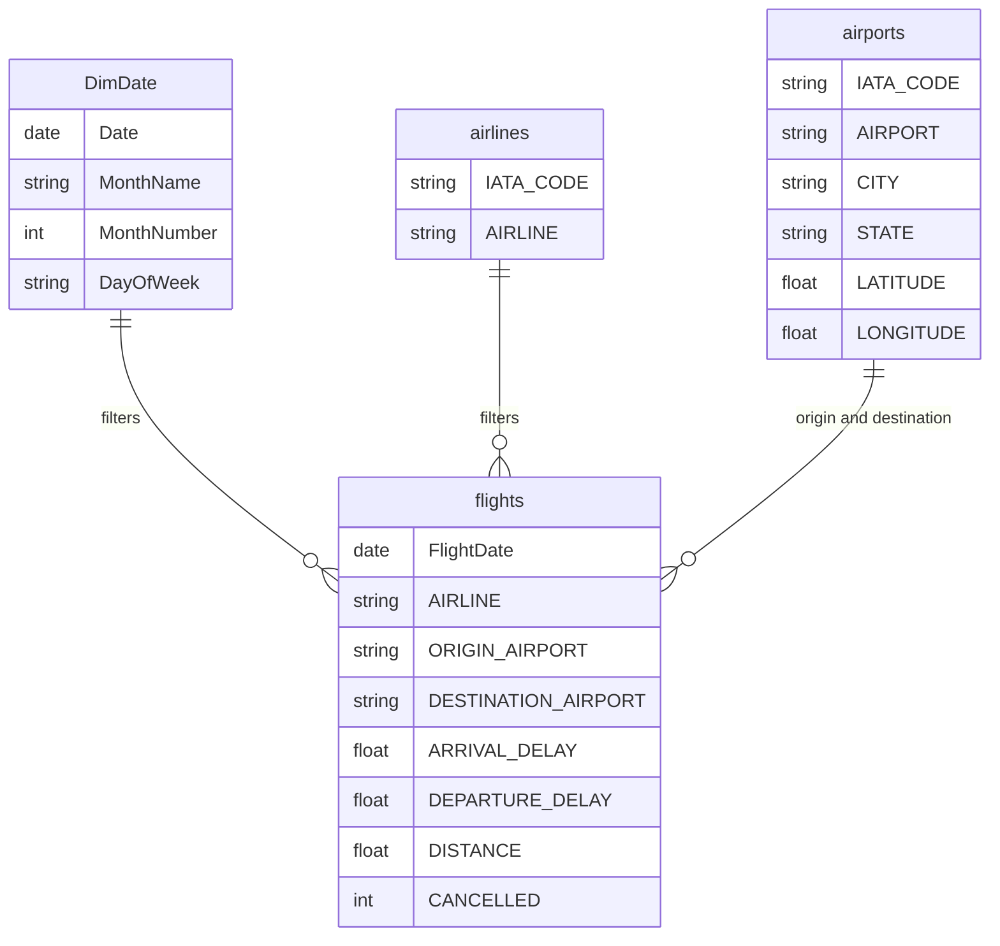

# US Flight Delay Performance Dashboard

<p align="center">
  <strong>Interactive Power BI analysis of airline punctuality, airport congestion, delay causes and seasonal flight-performance patterns across the United States.</strong>
</p>

<p align="center">
  
  
  
  
</p>

<p align="center">
  
</p>

<p align="center">
  <a href="./US%20Flight%20Delays.pbix"><strong>Download Power BI Dashboard</strong></a>
  &nbsp;&nbsp;|&nbsp;&nbsp;
  <a href="./US-Flight-Delay-Analysis-Presentation.pdf"><strong>View Project Presentation</strong></a>
</p>

---

## Project Overview

Flight delays affect passengers, airlines and airport operations. This project converts raw US flight records into an interactive Power BI dashboard that helps users identify performance trends, compare airlines, examine airport-level congestion and understand the main causes of disruption.

The solution combines:

- Data cleaning and transformation in Power Query
- Dimensional modelling using a star-schema approach
- DAX measures for operational KPIs
- Interactive filtering by flight-distance category
- Visual analytics for airline, airport, temporal and geographic comparison

The final dashboard provides a concise operational view of more than five million flight records.

---

## Dashboard Highlights

| KPI | Result | Interpretation |
|---|---:|---|
| Total Flights | 5M+ | Large-scale view of US flight operations |
| On-Time Rate | 68.9% | Share of flights meeting the defined on-time condition |
| Average Arrival Delay | -2.06 minutes | Flights arrived slightly early on average across the full dataset |
| Cancellation Rate | 1.71% | Proportion of scheduled flights recorded as cancelled |

> **Important:** A negative arrival-delay value represents an early arrival, not a worsening delay.

---

## Business Questions Answered

The dashboard was designed to answer the following questions:

1. How does average arrival delay change throughout the year?
2. Which airlines perform best and worst against scheduled arrival times?
3. Which airports account for the largest delay volumes?
4. What are the dominant causes of delay?
5. How does flight distance affect punctuality and cancellation performance?
6. Where is flight activity geographically concentrated?

---

## Data Preparation and Feature Engineering

The raw operational data was prepared in Power Query before being loaded into the analytical model.

### Data Cleaning

- Replaced missing delay-cause values with zero where appropriate
- Standardised column data types
- Removed invalid or inconsistent records
- Prepared numeric fields for reliable aggregation

### Time Standardisation

- Converted numeric `HHMM` fields into valid time values
- Created a complete flight-date field from year, month and day columns
- Derived month name, month number, quarter and day-of-week attributes

### Delay Engineering

Flights were classified into operational categories:

| Category | Definition |
|---|---|
| On Time | Arrival delay of 0 minutes or less |
| Minor Delay | Arrival delay from 1 to 15 minutes |
| Major Delay | Arrival delay greater than 15 minutes |

Additional fields included:

- On-time indicator
- Total-delay metric
- Cancellation and diversion indicators
- Delay-cause values for airline, air-system, weather, security and late-aircraft disruption

### Distance Segmentation

| Distance Band | Definition |
|---|---|
| Short Haul | 500 miles or less |
| Medium Haul | 501 to 1,500 miles |
| Long Haul | More than 1,500 miles |

This segmentation enables like-for-like comparison across different route types.

---

## Data Model

A star-schema design separates measurable flight activity from descriptive attributes used for slicing and filtering.



### Why a Star Schema?

- Simplifies relationships and report navigation
- Improves filtering and analytical performance
- Separates numeric measures from descriptive dimensions
- Supports consistent calculations across visuals
- Makes the model easier to maintain and extend

---

## Core Measures

The dashboard uses DAX measures to calculate and present key operational indicators, including:

- Total Flights
- On-Time Flights
- On-Time Rate
- Average Arrival Delay
- Average Departure Delay
- Cancelled Flights
- Cancellation Rate
- Major and Minor Delay Counts
- Delay-Cause Totals

These measures respond dynamically to report filters and distance-band selections.

---

## Dashboard Components

### KPI Cards
Provide immediate visibility of total flight volume, punctuality, average arrival delay and cancellations.

### Monthly Trend Line
Shows how average arrival performance changes across the year and highlights seasonal variation.

### Airline Comparison
Ranks carriers by average arrival delay, making performance differences and outliers easier to identify.

### Delay-Cause Breakdown
Displays the relative contribution of operational delay categories such as airline and air-system delays.

### Airport Performance Matrix
Compares major delays, minor delays, on-time flights and total flight activity across high-volume origin airports.

### Geographic Map
Shows the spatial distribution of flights and highlights major traffic hubs.

### Distance-Band Slicer
Allows users to compare all flights with short-, medium- and long-haul operations.

---

## Key Insights

- Overall on-time performance is **68.9%**, indicating a meaningful opportunity for operational improvement.
- Average arrival delay varies substantially by month, demonstrating clear seasonal changes in schedule performance.
- Several airlines record near-zero or negative average arrival delays, while others show notably higher average lateness.
- High-volume hubs such as **ATL, ORD, DFW and DEN** contribute large absolute delay counts because they process significant traffic volumes.
- Minor delays occur more frequently than major delays across most of the busiest airports.
- Airline and air-system issues account for a large share of the recorded delay minutes.
- Short-haul flights show slightly stronger on-time performance than long-haul flights in the dashboard comparison.

> High delay volume should not automatically be interpreted as poor airport performance. A heavily used hub may record more delayed flights simply because it handles more flights. Delay rates should therefore be assessed alongside total traffic.

---

## Visual Design Approach

The report applies consistent visual-encoding principles to improve readability and decision support:

- **Position:** Bar and line charts support accurate comparison across categories and time.
- **Colour:** Green represents on-time activity, orange represents minor delays and red represents major delays.
- **Size:** Geographic intensity communicates relative flight volume.
- **Consistency:** Repeated layouts, labels and scales reduce visual clutter.
- **Interactivity:** Slicers allow users to explore route-distance segments without changing pages.

---

## Tools and Skills Demonstrated

- Microsoft Power BI Desktop
- Power Query and data transformation
- DAX measure development
- Dimensional modelling
- Star-schema design
- Data cleaning and feature engineering
- KPI design
- Interactive dashboard development
- Geographic and temporal analysis
- Analytical storytelling

---

## Repository Structure

```text
us-flight-delay-performance-dashboard/
|
|-- US Flight Delays.pbix
|-- US-Flight-Delay-Analysis-Presentation.pdf
|-- README.md
|-- assets/
|   `-- dashboard-preview.png
|-- .gitattributes
`-- .gitignore
```

---

## How to Run the Dashboard

The Power BI file is stored using Git Large File Storage.

```bash
git lfs install
git clone https://github.com/Muhammad-Siraj-Bilal/us-flight-delay-performance-dashboard.git
cd us-flight-delay-performance-dashboard
```

Then open:

```text
US Flight Delays.pbix
```

in Microsoft Power BI Desktop.

---

## Analytical Considerations

- The results depend on the quality and coverage of the source dataset.
- The on-time classification used in this project treats an arrival delay of zero minutes or less as on time.
- Average delay values can hide variation, so they should be interpreted alongside flight counts and delay categories.
- Airport delay totals are influenced by traffic volume and should not be treated as a normalised performance ranking.
- Geographic visuals show concentration and distribution, but they do not establish causality.

---

## Potential Future Enhancements

- Add delay rates per airline and airport to complement absolute delay totals
- Introduce route-level drill-through analysis
- Add custom tooltips and detailed airport profiles
- Create weekday, hour-of-day and seasonal comparisons
- Analyse cancellation reasons separately from arrival delays
- Build predictive models for delay-risk estimation
- Publish an interactive version through Power BI Service
- Add a formal data dictionary and DAX measure catalogue

---

## Academic Context

This dashboard was developed as a **Team 14** academic project for **CST4245 - Data Visualisation, Computer Vision and Imaging**. It demonstrates the end-to-end process of preparing operational data, designing a dimensional model and communicating analytical findings through an interactive business-intelligence dashboard.

---

## Author

**Muhammad Siraj Bilal**  
GitHub: [@Muhammad-Siraj-Bilal](https://github.com/Muhammad-Siraj-Bilal)

---

<p align="center">
  If this project was useful, consider giving the repository a star.
</p>
